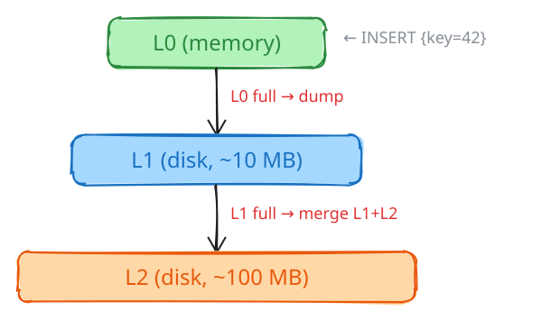
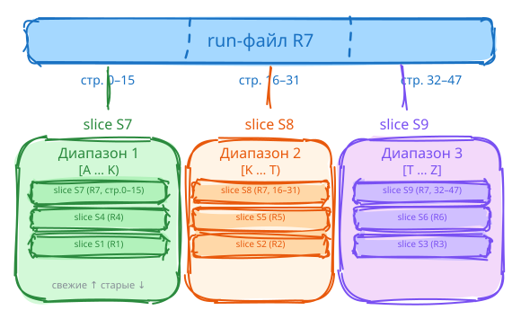
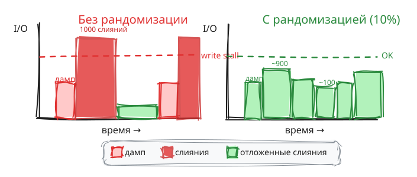
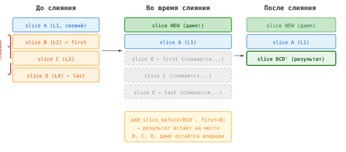

# Как мы переписали сборку мусора в Vinyl

*Константин Осипов, Picodata*

В [предыдущей статье о Vinyl](https://habr.com/ru/companies/vk/articles/358210/)
я рассказывал об архитектуре LSM-движка Tarantool.
8 лет с написания статьи показали, что Винил настолько хорош, что 
его не нужно менять :). Если серьёзно, сегодня я расскажу
о тех изменениях которые внёс в алгоритм в рамках форка от Picodata,
и неизбежно коснусь более глубокой проблематики структуры данных
LSM-дерева, а конкретно compaction scheduler, то есть планировщике
слияний. 

Но сначала о том какую именно проблему решает compaction scheduler
 и почему алгоритма, написанного 8 лет назад нам стало недостаточно.

Начну с базы, а именно того, как устроено тривиальное LSM дерево.
Основная идея LSM - амортизация стоимости вставок за счёт более
высокой стоимости чтений. При вставке данные не попадают немедленно
в свой целевую локацию во внешней памяти (на SSD), а кэшируются в оперативной памяти. При
переполнении кэша, он вытесняется на диск, а после нескольких вытеснений
данные из всех вытесненных файлов сортируются и сливаются в новый общий файл
где изменения по одному и тому же ключу объединяются.
При этом такой подход фактически меняет субъект хранения - вместо того,
чтобы хранить строки, LSM деревья хранят и упорядочивают изменения. При
чтении все изменения собираются воедино для получения итогового результата.

Подход получил широкое распространение с переходом на SSD диски, где чтение
в разы дешевле чем запись, но и отлично себя проявляет с SATA 
дисками, за счёт отсутствия рандомизированных чтений.
Подробнее вы можете почитать в моей оригинальной статье.

## Compaction vs VACUUM: сходство и отличия

Подход с версионированием изменений не уникален для LSM.
Похожим образом MVCC движки, например PostgreSQL управляют множеством
версий порождаемых транзакциями над одними и теми же данными. 
Но между VACUUM в B-tree и слиянием в LSM есть принципиальная разница.

В B-tree стоимость операции предсказуема. Вставка строки — это
O(log N) обращений к диску, плюс-минус split страницы. VACUUM
работает асинхронно и не влияет на стоимость транзакции. Да,
если VACUUM не успевает, таблица «раздувается» (table bloat) —
но каждая отдельная транзакция по-прежнему стоит O(log N).

В LSM-дереве такой гарантии нет. Вставка строки в L0 (верхний
уровень, in-memory) — O(1). Но если L0 переполняется, запускается
дамп (сброс на диск). Дамп может переполнить L1, что вызовет
слияние L1 с L2. Слияние L1 с L2 может переполнить L2, что
вызовет слияние L2 с L3 — и так далее, каскадом, вплоть до
полного слияния всех уровней (major compaction). Одна вставка
может спровоцировать перезапись всех данных на диске.



Амортизация дампов и слияний
одна из ключевых функций планировщика
слияний. Так, например, винил устраняет пики и шквалы при работе
нескольких экземпляров СУБД на одном узле, в остутствие централизованной
координации слияний между экземплярами за счёт рандомизации: в решения
планировщика вносится контролируемый "хаос" в 10% случаев. Также 
планировщик постоянно измеряет скорость ввода-вывода, скорость вставок,
и "подкручивает" приоритеты так, чтобы оперативной памяти было в любой
момент достаточно для новых вставок. Но помимо устранения спайков
в раоте и стагнации транзакций есть и другая задача планировщика, не менее важная. 

Сложность рассуждений здесь состоит в том, что эта задача не представима
одной целевой функцией. Она распадается на 3 цели, каждая из которых
вступает в противоречие с двумя остальными. 

Происхождение этих терминов мне неизвестно, но популяризованы
они были Марком Кэллэхэном, который в то время работал в Facebook над
движком RocksDB. 

Это read, write, и space amplification.

Красота этих терминов в том, что они позволяют рассуждать о
любом алгоритме не в терминах конкретной стоимостной модели, 
то есть количестве шагов некоторого абстрактного "вычислителя", а 
в терминах некой амортизированной стоимости. 

Так, read amplification показывает то, во сколько раз больше
байт СУБД вынуждена прочитать при чтении 1 байта полезных данных.
Ну например, затребовали вы срочно узнать пол некоего
субъекта, идентифицированного его СНИЛС. Теоретически 
вам нужно прочитать 1 байт, а вот Б-дерево вам предложит чтение
1 страницы, то есть 4 килобайт.  Read amplification составит 4096:1,
или просто 4096.

Write amplification измеряется похожим образом, но применяется
к записи на диск. Меняем 10 байт, пишем 100 байт - write amplification
составит 10. 

Space amplification позволяет учесть затраты на фрагментацию, 
технические данные и мусор. 

Так, для Б-дерева с небольшим размерм блока, скажем в 4кб, 
типичный read/write/space amp составляет 12-15/12-15/1.2-1.5.
Легко видеть, что Б-дерево - довольно сбалансированная структура данных.

Для LSM дерева цифры выглядят совсем по-другому: скажем 20-30/2-3/1.5-2.
Здесь легко видеть, что в LSM основная работа происходит при чтениях, 
но есть и другой аспект - разброс выше и фактические результаты
зависят от конкретной нагрузке.

Также можно прикинуть, что при стоимости чтений в SSD дисках в 4-8 раз
ниже стоимости записи (посмотрите характеристики по  IOPS у вашго SSD) "на
круг" LSM деревья получаются "выгоднее".

Но есть и другой "нюанс". В Б-дереве стоимость предсказуемо
транслируется в затраты каждой конкретной операции. В то время
как планировщих LSM обязан учитывать множество "краевых" случаев.


О них мы сейчас поговорим более подробно.

Первый специальный сценарий который хотелось бы рассмотреть, это вставка
time-series данных и в целом append-only, LIFO-like нагрзуки.

Из приведённых примеров, кажется, очевидно почему цели read, write и
space-amplification взаимно противоречивы: снижение write amplification
требует снижения compaction, что в свою очередь приводит к повышению
read и space amplification. Снижение read amplification требует повышения
compaction, что в целом может приводит к временному повышению space
apmlifcation, так как необходимо хранить промежуточные результаты слияния,
ну и конечно  write amplificaiton, т.к. это слияние нужно делать. Ну и
снижение space amplificaiton в сценарии удаления мусора из дерева, а
конкретно tombstones, конечно приводит к повышение write amplification
за счёт более частых слияний. 

Надо ли говорить, что спрашивать пользователя СУБД какой именно должен быть
компромисс - бесполезно? Дело не в том что разработчик не компетентен,
он в целом ряде случаев сам не знает что было бы оптимально для его задачи.


Это усугубляется на специальных нагрузках. Возьмём «горячие»
ключи — когда одна и та же строка обновляется тысячи раз.
В B-tree каждое обновление перезаписывает строку на месте
(in-place update). В LSM-дереве каждое обновление добавляет
новую версию на L0. Все эти версии копятся на разных уровнях
и при чтении должны быть слиты — read amplification растёт
пропорционально количеству версий.

Или time-series данные: записи приходят с монотонно растущим
ключом. Все они попадают в один и тот же диапазон, создавая
локальную «горячую точку» — один диапазон переполняется и
требует слияния, остальные простаивают.

Или вторичные ключи: у каждого индекса своё LSM-дерево, и
дамп одной транзакции может затронуть несколько деревьев
одновременно, каждое из которых требует своего слияния.

Bender и Kuzmaul в своих работах по fractal trees показали,
что *в среднем* — на случайных данных — LSM-дерево
укладывается в хорошие алгоритмические оценки. Но продакшен
редко бывает средним. Горячие ключи, time-series, вторичные
индексы — все эти частные случаи порождают проблемы, которых
нет в теоретическом анализе.

И вот ключевая особенность: **в LSM-дереве I/O не привязан
к моменту транзакции**. Транзакция записывает данные в память
и возвращает управление. Фактическая запись на диск происходит
позже — при дампе. Слияние — ещё позже. Это создаёт шквалы
I/O, которые нужно специально распределять: между инстансами
на одном диске, между таблицами в пределах инстанса, между
чтением и записью в пределах одной таблицы. Управление этими
шквалами — главная задача планировщика слияний.

## Устройство Vinyl

Прежде чем перейти к планировщику, давайте определимся с
терминологией — иначе дальше будет трудно.

В Vinyl данные на диске хранятся в **run-файлах** — это
отсортированные файлы, аналог SST-файлов в RocksDB. Каждый
run-файл содержит набор строк, упорядоченных по первичному ключу.

Ключевое пространство индекса разбито на непрерывные
**диапазоны** (в коде — `vy_range`). Каждый диапазон отвечает
за свой участок ключей и содержит упорядоченный список ссылок
на данные — от самых свежих к самым старым. Но ссылается диапазон
не на целый run-файл, а на его часть — **slice**. Slice — это
пара (run-файл, начальная страница, конечная страница). Один
run-файл может быть разделён на несколько slice, каждый из
которых принадлежит своему диапазону.

Зачем такая косвенность? Дело в том, что при дампе (сбросе
данных из памяти на диск) создаётся один run-файл, который
может пересекать несколько диапазонов. Вместо того чтобы
записывать отдельный файл для каждого диапазона, мы записываем
один файл и создаём несколько slice — по одному на каждый
затронутый диапазон.



Это ключевое отличие от RocksDB, где каждый SST-файл
принадлежит ровно одному уровню и одному диапазону ключей.
Наш подход даёт важное преимущество: когда диапазон нужно
разбить пополам (потому что он стал слишком большим), нам
не нужно перезаписывать run-файлы — достаточно создать
новые slice. Но эта же архитектура порождает задачи, которых
у RocksDB просто нет.

## Что было не так со старым планировщиком

Старый планировщик был устроен просто: он считал количество
run-файлов в диапазоне, и когда их набиралось больше порога —
назначал слияние. Подход работал на небольших данных с
равномерной нагрузкой. Но в продакшене всё оказалось сложнее.

### Стадный эффект

Все диапазоны в одном индексе имеют одинаковую конфигурацию.
После дампа все они одновременно получают по новому slice от
свежего run-файла. Представьте: у вас 1000 диапазонов, и до дампа
в каждом было ровно 3 run-файла при пороге 4. После дампа
становится 4 — и все 1000 диапазонов одновременно требуют
слияния. Диск получает 1000 задач сразу. Пропускная способность
записи проваливается, следующий дамп задерживается, квота памяти
исчерпывается, транзакции блокируются.

RocksDB страдает от того же эффекта. Их документация описывает
«write stalls» — ситуации, когда пропускная способность падает
с 40 000 операций в секунду до 1 600. Решение RocksDB —
три порога торможения записи: `level0_slowdown_writes_trigger`,
`level0_stop_writes_trigger`, `soft_pending_compaction_bytes`.
Мы решили, что лучше не тормозить записи, а не допускать
ситуации, когда торможение необходимо.

### Space amplification

Space amplification — это отношение занятого на диске места
к объёму полезных (живых) данных. Cassandra в режиме STCS
(Size-Tiered Compaction Strategy) может довести space amplification
до 8x: один и тот же ключ хранится в нескольких копиях на разных
уровнях. Хуже того, во время самого слияния нужен двойной
запас места — отсюда знаменитая рекомендация «никогда не
заполняйте диск более чем на 50%». Мы хотели гарантировать
space amplification менее 2x без таких оговорок.

### Куда вставить результат слияния

Пока фоновый поток выполняет слияние, основной поток продолжает
работать: принимает транзакции, выполняет дампы, добавляет
новые slice в начало списка диапазона. Когда слияние завершается,
результирующий slice должен занять *точно то же место* в списке,
где стояли исходные slice. Если ошибиться с позицией — нарушится
порядок LSM-дерева, и одна и та же строка окажется видимой
дважды.

## Как устроен новый планировщик

### Форма дерева и уровни

Slice в диапазоне организованы в уровни, как в классическом
LSM-дереве. Каждый следующий уровень в `run_size_ratio` раз
(по умолчанию 10) больше предыдущего. На каждом уровне может
быть не более `run_count_per_level` файлов. Когда порог
превышен — этот уровень и все уровни выше идут на слияние.

Ключевой инвариант: на последнем (самом нижнем) уровне
допускается не более одного файла. Это гарантирует, что
space amplification не превышает
`(run_count_per_level - 1) / (run_size_ratio - 1) + 1`.
При стандартных настройках (4 файла на уровень, ratio 10) —
менее 1.33x.

Любопытная деталь: целевой размер уровня вычисляется не
снизу вверх, а *сверху вниз* — от размера самого старого
файла. Мы делим его на `run_size_ratio` до тех пор,
пока результат не станет больше размера самого свежего
файла. При этом используется `ceil()`, а не целочисленное
деление — иначе на нижнем уровне целевой размер окажется
чуть *меньше* реального, и space amplification в худшем
случае вырастет на `run_count_per_level`. Мы наступили
на эти грабли ровно один раз.

RocksDB начиная с версии 8.4 использует аналогичный
подход — Dynamic Level Sizing — тоже вычисляя целевые
размеры от фактического размера последнего уровня.
Но у RocksDB каждый уровень — глобальная структура,
а у нас — per-range. Каждый диапазон имеет свою форму
дерева, свой приоритет, свой темп слияний.

### Рандомизация: разрушаем стадный эффект

Чтобы диапазоны не требовали слияния одновременно, мы
добавили простой приём. Каждый slice при создании получает
случайное число:

```c
slice->seed = rand_r(&run->env->seed);
```

(Мы используем `rand_r()` с per-engine seed, а не
глобальный `rand()` — чтобы другие подсистемы не влияли
на решения планировщика.)

При проверке формы дерева 10% slice — те, у которых
`seed < RAND_MAX / 10` — получают бонус: для них порог
`run_count_per_level` увеличивается на единицу. Иными
словами, примерно каждый десятый диапазон откладывает
слияние на один дамп.

Эффект: после дампа не все 1000 диапазонов одновременно
требуют слияния, а, скажем, 900. Оставшиеся 100
подождут до следующего дампа. Нагрузка на диск
размазывается во времени, пики I/O сглаживаются.



Ни RocksDB, ни Cassandra рандомизацию на уровне
планировщика не используют. RocksDB рассчитывает на то,
что SST-файлы разного размера естественно приводят
к разным моментам слияния. На практике, особенно при
равномерной нагрузке, этого недостаточно.

### Раздельные пулы потоков

Дамп — это сброс данных из памяти на диск. Если дамп
задерживается, квота памяти исчерпывается и транзакции
блокируются. Слияние — это перестройка данных на диске.
Если слияние задерживается, растёт read amplification
(усиление чтения), но система продолжает работать.

Приоритеты разные — значит, и пулы потоков должны быть
разные. Мы выделили 1/4 рабочих потоков исключительно
для дампов, 3/4 — для слияний. Дамп никогда не ждёт,
пока освободится поток слияния.

Решение простое, но важное. В RocksDB дампы и слияния
конкурируют за общий пул `max_background_jobs`. Длинное
слияние L0 -> L1 может заблокировать дамп, что вызывает
каскадный write stall — тот самый провал с 40 000 до
1 600 операций в секунду.

### Позиционная вставка: slice на своё место

Вот одна из задач, которых нет в RocksDB (потому что
у них нет slice). Когда слияние завершается, новый slice
должен встать на место старых. Но пока слияние работало
в фоновом потоке, основной поток мог добавить свежие
slice через дамп.



Решение: при создании задачи слияния мы запоминаем
`first_slice` и `last_slice` — границы того, что сливаем.
При завершении вставляем результат *непосредственно перед*
`first_slice`:

```c
if (new_slice != NULL)
    vy_range_add_slice_before(range, new_slice, first_slice);
for (slice = first_slice; ; slice = next_slice) {
    next_slice = rlist_next_entry(slice, in_range);
    vy_range_remove_slice(range, slice);
    if (slice == last_slice)
        break;
}
```

Всё, что было добавлено дампом *после* начала слияния,
оказывается в списке *перед* `first_slice` (дамп всегда
добавляет в начало). Результат слияния встаёт на место
старых slice, новые данные остаются впереди. Порядок
LSM-дерева сохранён.

### Общие run-файлы: когда можно удалять?

Run-файл может быть разделён на slice в нескольких
диапазонах. Слияние обрабатывает один диапазон. Как
понять, что файл больше никому не нужен?

Мы используем счётчик `compacted_slice_count`: при
завершении слияния увеличиваем его на единицу за каждый
слитый slice. Если `compacted_slice_count` сравнялся
с `slice_count` — все slice этого run-файла были слиты,
и файл можно удалить:

```c
for (slice = first; ; slice = next) {
    slice->run->compacted_slice_count++;
    if (slice == last) break;
}
for (slice = first; ; slice = next) {
    if (slice->run->compacted_slice_count ==
        slice->run->slice_count)
        rlist_add_entry(&unused_runs, run, in_unused);
    slice->run->compacted_slice_count = 0;
    if (slice == last) break;
}
```

Не нужен отдельный сборщик мусора, не нужен reference
counting с атомарными операциями — простой счётчик,
сбрасываемый после каждой проверки.

### Разбиение диапазонов без перезаписи

Когда диапазон вырастает до `4/3 * range_size`, мы
разбиваем его пополам по медианному ключу самого старого
run-файла. При этом run-файлы *не перезаписываются*: для
каждого файла создаются два новых slice (левый и правый)
через `vy_slice_cut()`, которая вычисляет пересечение
ключевых диапазонов и находит соответствующие номера
страниц в run-файле.

В RocksDB разбиение диапазона ключей — операция уровня
приложения (например, TiKV Region Split). RocksDB о ней
ничего не знает. Исторически это приводило к тому, что
границы SST-файлов не совпадали с границами регионов,
и при слиянии приходилось перезаписывать данные, не
относящиеся к нужному региону — по оценкам разработчиков
RocksDB, около 14% лишней работы. С версии 7.8 они
добавили выравнивание границ выходных файлов по границам
файлов следующего уровня — но это скорее заплатка, чем
архитектурное решение.

## Сравнение с конкурентами

Давайте сведём основные характеристики в таблицу. Write
amplification — это отношение объёма фактически записанных
на диск данных к объёму полезных записей. Space amplification —
отношение занятого места к объёму живых данных.

| | Vinyl | RocksDB | Cassandra STCS | Cassandra LCS |
|---|---|---|---|---|
| Write amplification | ~10x | 20–33x | ~5x | ~13x |
| Space amplification | <2x (гарантия) | ~1.1x | до 8x | 1.1–2x |
| Запас места для слияния | минимальный | ~10% | **50%** | ~10% |
| Защита от стадного эффекта | рандомизация | нет | нет | нет |
| Разбиение диапазонов | без перезаписи | на уровне приложения | нет | нет |
| Write stalls | нет | да (три порога) | нет | нет |

Cassandra STCS выигрывает по write amplification (~5x),
но платит за это катастрофическим space amplification — до 8x,
плюс требование держать 50% диска свободным. Cassandra LCS
и RocksDB дают хорошее space amplification, но ценой write
amplification 13–33x. Vinyl находит баланс: space amplification
менее 2x при write amplification около 10x.

## Что впереди

На ветке `kostja-vinyl-page-index` сейчас готовится набор
изменений, которые затрагивают не только планировщик, но и
формат хранения на диске.

### Страничный индекс нового формата

Сейчас Vinyl хранит индекс страниц (`page_info`) каждого
run-файла целиком в памяти. Для терабайтного набора данных
это сотни мегабайт одних только метаданных.

Новый формат (файлы `.index2`) группирует метаданные в
*индексные блоки* по 64 страницы. Каталог блоков — несколько
десятков килобайт — хранится в памяти; сами блоки подгружаются
по требованию через 2Q-кэш (по умолчанию 128 МБ). По сути,
это двухуровневый B-tree: компактный каталог в RAM, данные
на диске.

### Binary fuse8 вместо фильтров Блума

Классический фильтр Блума требует ~10 бит на ключ и должен
целиком помещаться в памяти. Мы заменяем его на binary fuse8
filter — структуру, требующую ~9 бит на ключ, с нулевым
процентом ложноотрицательных результатов и ~0.4%
ложноположительных. Фильтры хранятся в индексных блоках
и подгружаются по требованию вместе с ними.

### MinHash-скетчи

Каждый индексный блок содержит MinHash-скетч (64 хеша)
своего набора ключей. При планировании слияния скетчи
двух slice можно сравнить за O(1) и оценить коэффициент
Жаккара — степень пересечения их ключевых множеств. Если два
файла на одном уровне почти не пересекаются — нет смысла их
сливать: это не уменьшит ни space amplification, ни read
amplification.

### Bloat detection

Когда run-файлы, разделённые между несколькими диапазонами,
накапливают «мёртвые» страницы — не покрытые живыми slice —
новый планировщик назначает слияние отдельного slice для
освобождения места. Порог: 10% от размера slice. Пересчёт
приоритетов распространяется на соседние диапазоны «крабовым
обходом» — от центра к краям.

### Слияние по фактическому read amplification

Новый механизм отслеживает отношение прочитанных байт к
полезным для каждого диапазона. Когда потери при чтении
превышают размер данных диапазона — планировщик инициирует
слияние, даже если форма дерева в норме.

Этого подхода нет ни в RocksDB, ни в Cassandra. Решение
о слиянии принимается на основе реальной нагрузки чтения,
а не теоретической формы дерева. Если данные читаются
часто и при этом read amplification высокий — мы сливаем.
Если данные не читаются — не тратим I/O зря.

### TTL

Поддержка TTL на уровне движка позволит автоматически
удалять устаревшие строки. В сочетании с индексными
блоками и MinHash-скетчами это даст возможность эффективно
определять, какие run-файлы содержат только истёкшие данные,
и удалять их целиком — без слияния. Похоже на Time-Window
Compaction в Cassandra, но интегрировано в общий планировщик.

## Итого

Планировщик слияний — это та часть LSM-движка, о которой
пользователь не думает, пока всё работает. Но стоит ему дать
сбой — и latency скачет, диск раздувается, пропускная способность
проваливается.

Переписывая планировщик Vinyl, мы ставили три цели:
предсказуемая производительность (никаких write stalls),
контролируемое space amplification (менее 2x) и разумное
write amplification (~10x). Архитектура общих run-файлов
через slice потребовала решения нетривиальных задач —
позиционная вставка, определение момента удаления
общего файла, разбиение диапазонов без перезаписи.
Но она же дала возможности, которых нет у конкурентов.
